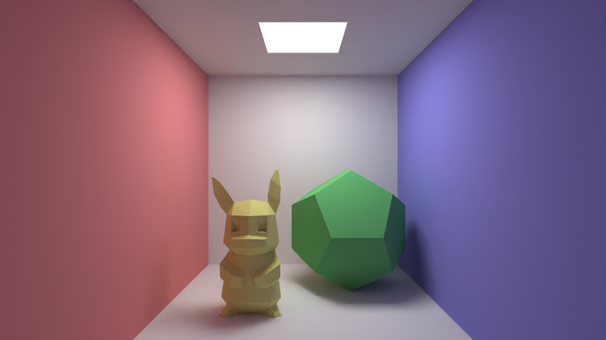
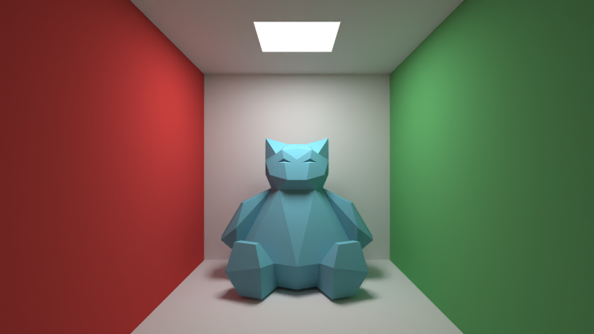

# Real-time Ray Tracer
A real-time path tracing engine developed in C++, using the Windows API for window management, and Intel's Open Image Denoiser (OIDN) for image denoising.

## Key Features
- Simulated realistic lighting in real time with diffuse surfaces, reflective materials, and configurable light sources, using physically accurate path tracing algorithms.
- Enabled dynamic scene interaction with keyboard and mouse controls for camera movement and viewpoint adjustments.
- Integrated AI denoising to achieve photorealistic renderings without sacrificing image quality, enhancing rendering efficiency by 16x.
- Implemented 3D model rendering as triangle meshes, leveraging efficient algorithms and techniques 
- Optimized rendering performance by implementing multithreading, resulting in a 10x speedup in render times.

## Sample Renders

